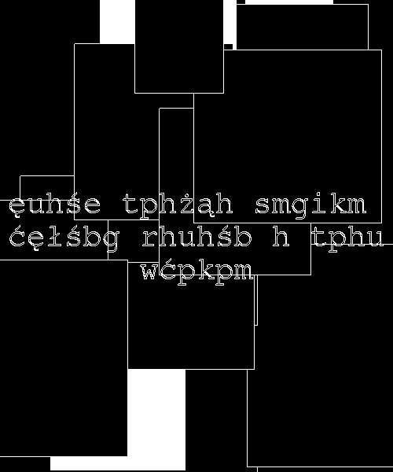

# Task number 2

Image decryption result  
  
Then program makes by letter list from Szablon.png text file (litery.txt) with fill factor for all letters. It could be helpfull with reading letters from image.  

